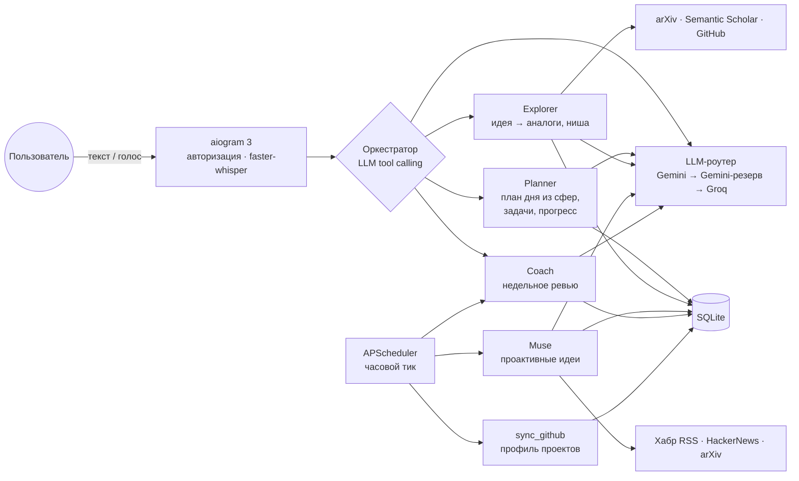

# Global Assistant

Мультиагентный Telegram-ассистент личного развития на Python: план дня генерируется LLM из «сфер развития», прогресс трекается в SQLite, идеи исследуются по научным статьям и GitHub, ассистент сам пишет первым — по расписанию и без штрафов за проваленные дни.

<!--
Скриншоты реальных диалогов (см. docs/): раскомментировать после добавления.
Что снять: 1) ночная идея от Muse с кнопками «Исследовать/В архив»,
2) недельное ревью Coach с кнопкой «Применить», 3) голосовое «перенеси видео
на сегодня» и план со слотами.

<p align="center">
  
  
  
</p>
-->

## Архитектура

Оркестратор — один LLM-вызов с tool calling — принимает каждое сообщение и роутит его в суб-агента. Проактивные агенты запускает планировщик в том же event loop; вся блокирующая работа (LLM, HTTP, БД) уходит в поток через `asyncio.to_thread`.



| Агент | Что делает |
|---|---|
| **Planner** | Генерирует день блоками по 30 минут из «сфер развития» (учёба, чтение, спорт, отдых, готовка) с учётом профиля и вводных; переносит задачи по одной и группами; пишет прогресс (страницы, подходы×вес); задачи из YouTube-ссылок с длительностью из метаданных |
| **Explorer** | Идея → английские поисковые запросы → arXiv + Semantic Scholar + GitHub параллельно → синтез: что уже сделано, чем идея отличается, где ниша |
| **Muse** | Раз в N дней приносит 1–2 идеи pet-проектов: свежие тренды × навыки пользователя × случайное скрещивание; кнопки «Исследовать» (пайплайн Explorer) и «В архив» |
| **Coach** | Воскресное ревью по метрикам: выполнение по дням, скользящее среднее за 14 дней, динамика сфер к прошлой неделе; расчётное предложение изменить нагрузку применяется одной кнопкой |

## Стек

Python 3.13 · aiogram 3 · SQLite · APScheduler · faster-whisper · httpx · google-genai · groq

Внешние API — только бесплатные: arXiv, Semantic Scholar, GitHub Search, HackerNews (Algolia), Хабр RSS, YouTube Data API.

## Ключевые инженерные решения

- **Мультипровайдерный LLM-роутер** ([llm/router.py](llm/router.py)): единая абстракция `LLMProvider` (Gemini, Groq — OpenAI-совместимый tool calling конвертируется прозрачно), маппинг «агент → цепочка моделей» в одну строку конфига. 429 (квота) и 503 (перегрузка) распознаются как временные — запрос автоматически уходит к следующей модели цепочки. Free tier с лимитом 20–500 запросов/день на модель — реальное ограничение, ротация решает его без платных ключей.
- **Structured output с эскалацией** ([llm/structured.py](llm/structured.py)): JSON от модели парсится и валидируется кодом (блоки плана: окно дня, кратность 30 минут, пересечения, известные сферы); ошибка возвращается модели текстом на один ретрай, затем запрос эскалирует на следующую модель. Один модуль обслуживает генератор плана, Explorer и Muse.
- **Деградация вместо падения**: 429 от Semantic Scholar — норма free tier (лог и пропуск источника); анализ видео при исчерпании видео-квоты Gemini откатывается на метаданные YouTube API; недоступный источник трендов не отменяет запуск Muse.
- **Часовой тик планировщика с тихими часами**: джобы Muse/Coach дешёво просыпаются каждый час, а `is_due` сам решает, пора ли — интервал из конфига плюс окно бодрствования из профиля пользователя. Идея не придёт в 4 утра и не потеряется из-за рестарта сервиса.
- **Адаптивная нагрузка без штрафов**: вместо «сгоревших стриков» — скользящее среднее выполнения за 14 дней; две недели ниже 60% → Coach считает, какая сфера тянет вниз, и предлагает конкретное снижение (страницы ×0.7, блок −30 мин); две недели выше 85% — аккуратное повышение. Применение — одна кнопка, сам Coach ничего не меняет.
- **Групповые операции с honesty-отчётом**: «перенеси видео на сегодня» двигает семь задач разом, подбирая слоты по длительностям вокруг занятых блоков; что не влезло — остаётся на месте с явным вопросом пользователю, а не теряется молча.

## Быстрый старт

```bash
git clone https://github.com/aloneek/assistant_for_day.git && cd assistant_for_day
python3 -m venv .venv && source .venv/bin/activate
pip install -r requirements.txt

cp .env.example .env   # TELEGRAM_BOT_TOKEN, GEMINI_API_KEY, GROQ_API_KEY, TELEGRAM_CHAT_ID
python3 db/database.py && python3 db/seed.py
python3 main.py
```

Деплой на VPS (systemd, journald, бэкапы SQLite) — [DEPLOY.md](DEPLOY.md).

## Структура

```
agents/      оркестратор и суб-агенты (planner, explorer, muse, coach, video, github_sync)
bot/         Telegram: обработчики, голос, кнопки, авторизация, сплиттер 4096
db/          схема SQLite, миграции, сид сфер и профиля
llm/         LLMProvider, провайдеры Gemini/Groq, роутер с фолбэком, structured output
prompts/     системные промпты агентов (markdown)
search/      клиенты внешних API (httpx, параллельные запросы)
scheduler/   фоновые джобы: Muse, Coach, sync_github
```

---

Pet-проект: единственный пользователь — автор (авторизация по chat id, чужие сообщения игнорируются). Код и архитектура — учебные, но бот живёт на VPS и используется ежедневно.
